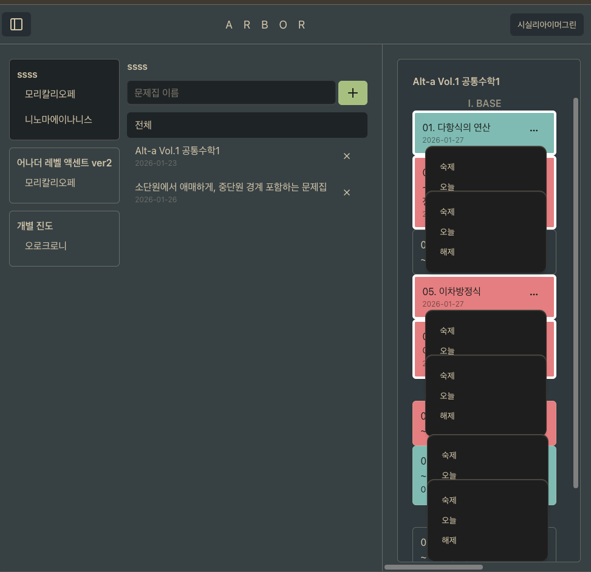

# 드롭다운의 `stopPropagation` 때문에 드롭다운이 꺼지지 않는 버그

- 발생 시각: 2026-01-27 18:19
- 문제: 드롭다운에서 `stopPropagation`을 했더니 다른 트리거를 눌렀을 때 꺼지지 않음
- 해결 시각: 2026-01-27 18:58

## 배경

- `ProgressSession`에서 클릭 이벤트를 감지해야 하는데 드롭다운도 있음
- 드롭다운을 여는 것은 클릭 이벤트에서 제외하기 위해 `stopPropagation`을 사용
- 다른 트리거를 눌러도 기존 드롭다운이 꺼지지 않게 됨 (완전 바깥을 클릭하면 여전히 꺼짐)



## 분석

### 외부 클릭 감지 방법

- 클릭 이벤트 핸들러 제작: 발생한 클릭이 관심 있는 ref에 포함되어 있는지 확인
- 해당 이벤트 핸들러를 `window.document`에 부착

### 실패 원인

- `stopPropagation` -> 이벤트 버블링 중지 -> `document`까지 올라가지 않음 -> 이벤트 핸들러가 호출되지 않음

### 해결책

- `stopPropagation`은 지금과 같은 여러 문제를 일으키니 안 쓸 수 있다면 쓰지 말자
- `Dropdown`에 `data` props로 식별자를 넣은 다음, 클릭 이벤트 핸들러에서 해당 식별자가 있는 곳에서 발생한 이벤트인지 판단하자

```ts
const handleSessionClick = (event: React.MouseEvent) => {
    // NOTE: 이벤트 발생 지점의 부모 중 가장 가까운 data-dropdown이 있나? 있으면 얼리 리턴, 없으면 원하는 함수 호출
    if ((event.target as HTMLElement).closest("[data-dropdown]")) {
        return
    }
    handleClickToComplete()
}
```

```ts
const handleClickToComplete = async (event: React.MouseEvent<HTMLDivElement, MouseEvent>) => {
    // NOTE: typeof event.target => EventTarget
    // NOTE: closest is method of HTMLElement
    // NOTE: to use data-* attribute, wrapping with square braket is mandatory
    const target = event.target as HTMLElement
    if (target.closest("[data-dropdown]")) {
        debugger
        return
    }
    if (!conciseSession.status) return

    await instance.post(`/progress/session/completed/${conciseSession.id}`, undefined, {
        params: searchParams,
    })
}
```
