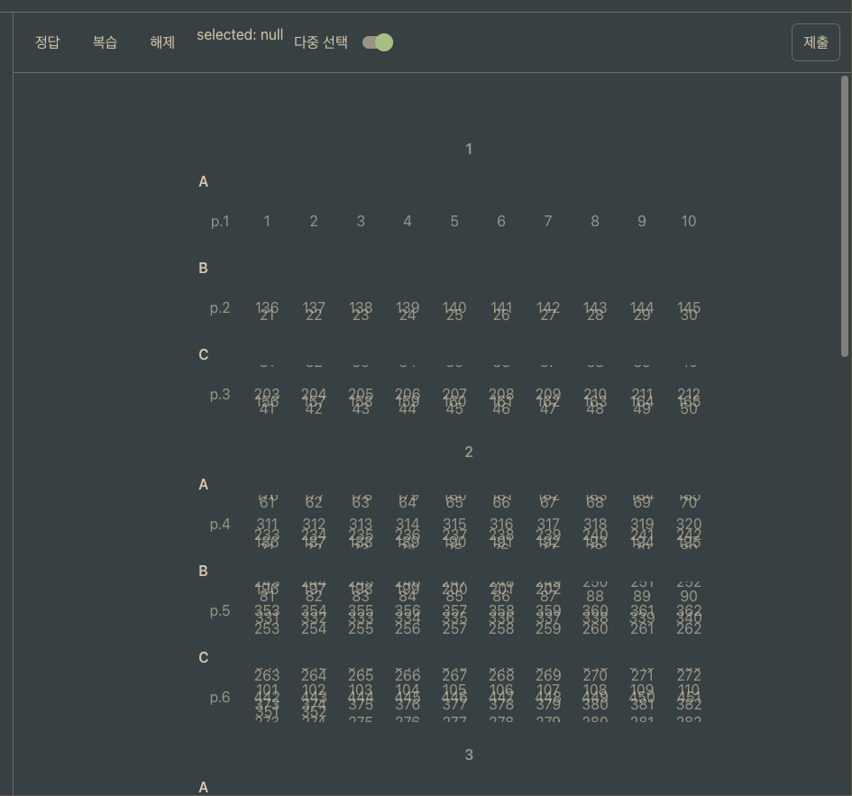
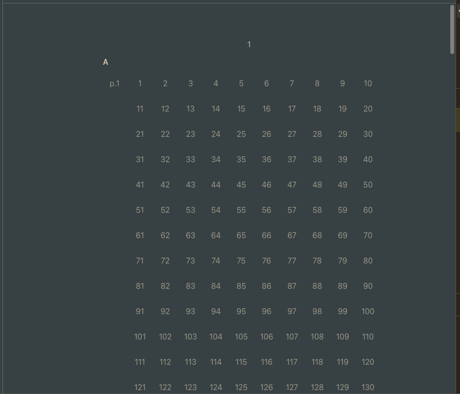

# Tanstack Virtual에서 높이 변하는 컴포넌트 올바르게 렌더링하기

- 발생 시각: 2026-02-10 18:30
- 문제: tanstack virtual에서 estimate size와 다른 높이를 가진 컴포넌트는 제대로 렌더링이 되지 않음
- 해결 시각: 2026-02-10 19:05

## 배경

- 오답 체크를 렌더링하기 위해 중단원 제목, 소단원 제목, 페이지별 오답 체크를 렌더링
- 페이지별 오답 체크가 한 줄을 초과할 경우 제대로 분리가 안 되고 뭉친 상태로 렌더링됨
- 개발자 도구로 확인해볼 때 virtual item을 감싸고 있는 div가 estimateSize 의 높이 만큼만 되어 있음
- useVirtualize의 옵션으로 measureElement를 넣었는데 달라지지 않음
- 적용한 코드
    - https://tanstack.com/virtual/latest/docs/introduction#the-virtualizer
    - https://tanstack.com/virtual/latest/docs/api/virtualizer#measureelement-1



```tsx
<FlexOneContainer isYScrollable ref={parentRef}>
    <Container
        style={{
            height: `${rowVirtualizer.getTotalSize()}px`,
            position: "relative",
        }}
    >
        {rowVirtualizer.getVirtualItems().map((virtualItem) => (
            <div
                key={virtualItem.key}
                ref={rowVirtualizer.measureElement}
                data-index={virtualItem.index}
                style={{
                    transform: `translateY(${virtualItem.start}px)`,
                    height: `${virtualItem.size}px`,
                }}
                className="absolute top-0 left-my-xl w-full"
            >
                <ReviewCheckFlatItemComponent flatItem={flatItemArray[virtualItem.index]} />
            </div>
        ))}
    </Container>
</FlexOneContainer>
```

## 분석

### 실패 원인

- dynamic sizing이 height styling으로 무시됨

### 해결책

1. height style 없애야
2. ref 설정
3. data-index 설정

```tsx
<FlexOneContainer isYScrollable ref={parentRef}>
    <Container
        style={{
            height: `${rowVirtualizer.getTotalSize()}px`,
            position: "relative",
        }}
    >
        {rowVirtualizer.getVirtualItems().map((virtualItem) => (
            <div
                key={virtualItem.key}
                ref={rowVirtualizer.measureElement}
                data-index={virtualItem.index}
                style={{
                    transform: `translateY(${virtualItem.start}px)`,
                }}
                className="absolute top-0 left-my-xl w-full"
            >
                <ReviewCheckFlatItemComponent flatItem={flatItemArray[virtualItem.index]} />
            </div>
        ))}
    </Container>
</FlexOneContainer>
```


