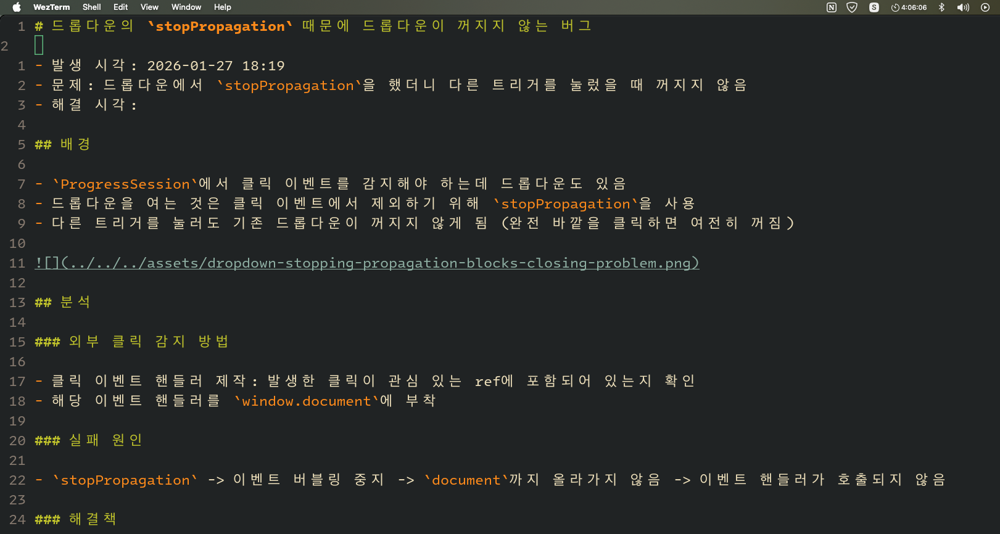

## Slide 1

<!--표지-->
<!-- 세로 4등분(1, 3) -->

|      |               |     |     |
| ---- | ------------- | --- | --- |
| 사진 | 하흥주        |     |     |
|      | Web Developer |     |     |
|      | Portfolio     |     |     |

## Slide 2

<!--자기소개 페이지-->
<!-- 세로 4등분 -->

| 사진 | About Me          | Education                      | Channel              |
| ---- | ----------------- | ------------------------------ | -------------------- |
|      | - 이름            | - 오즈코딩스쿨 프론트엔드 12기 | - 깃헙               |
|      | - 학교            |                                | - 내 블로그를 만들자 |
|      | - 아르보 수학학원 |                                |                      |
|      |                   |                                |                      |

## Slide 3

<!--보유 스택-->

### 프론트엔드

1. React
2. TypeScript
3. 상태 관리 ---- Zustand, TanStack Query, Router, Virtual, React Hook Form
4. Headless UI ---- Tanstack Table
5. 유효성 검사 ---- Zod

### 백엔드

1. Node.js
2. Express

### 데이터베이스

1. Neon(PostgreSQL)
2. Prisma
3. PostgreSQL

### 개발 환경

1. NeoVim
2. Tmux
3. Arch Linux

### 배포

1. AWS S3 + CloudFront
2. Railway

## Slide 4

<!-- 주요 프로젝트 목차-->

- 아르보 진도 관리 시스템
- 개인 blog: From terminal to web
- StudyHub 우리 파트

## 아르보 진도 관리 시스템 소개

### 제작 배경

- 학원 강사 재직 시절 혼자 사용할 목적으로 구축한 시스템을 상업적으로 쓰기에 재편
- 실사용을 전제로 제작

### troubleshoot: infinite rendering needs to be checked by logging vs eslint no console

#### 배경

- table을 memoize 하지 않고 만드는 경우가 종종 있음 -> 무한 렌더링 이슈
- no console rule을 사용하지 않으면 시간이 지날수록 console log로 지저분해져서 상황 판단이 어려워짐 -> no console
- 평소에 로그를 안 찍기 때문에 어디부터 로그를 찍어야할지 막막함
- 임시방편: opencode로 로그를 대신 찍으라 하고 콘솔창 확인
- 더 나은 방법 모색: debug package 이용, opencode 이용하여 debug 로깅

#### 문제 발생: ai 코드 리뷰하려는데, import 순서를 바꾸는 등, 불필요한 수정으로 무엇이 진짜 수정인지 판단이 어려워짐

- 저장할 때마다 organize import 하도록 prettier plugin 사용

### troubleshoot: 7 seconds response

#### 배경

#### 문제 파악

#### 해결

### troubleshoot: table modeling

#### 배경

- 반별 수업과 개별 수업을 동시에 운용하려다보니 엣지 케이스들이 너무 많음
- 반에 문제집 부여할 때
    - 모든 학생들에게 문제집 부여 되어야 -> `book_classroom` 모델
    - 하지만 진도 추적은 학생별로 되어야(뒤쳐지는 학생 알아야 하니까) -> 그럼 개별로??
        - 그렇다면 나중에 반에 들어갈 때 반에 이미 부여된 문제집이 신규 학생에게도 자동으로 부여되게 하는 게 어려움

#### ai raw

Book Assignment vs Session Tracking: Problem & Solution
Problem
| Level | Unit | Conflict |
|-------|------|----------|
| Book assignment | Classroom | "수학반 uses 수학의정석" - shared, 1 row |
| Session tracking | Student | "김철수 completed Session 3" - individual, needs per-student rows |
Core conflict: Books are assigned at classroom level, but progress must be tracked at student level. This creates sync issues:

- New student joins → missing session records
- New session added → existing students don't have it
- Book removed → orphan session records

---

Solution
Two separate models with different purposes:
book_classroom → "What books does this classroom use?" (shared)
student_session → "What is this student's progress?" (individual)
Key insight: Don't pre-create all student_session rows. Create them on-demand when assigning homework/today.
| Session state | student_session row |
|---------------|----------------------|
| Future (not assigned) | No row (derive from syllabus) |
| Homework | Row with HOMEWORK |
| Today | Row with TODAY |
| Done | Row with DONE |
Progress page query:
All sessions (from book → syllabus → sessions)
LEFT JOIN student_session
→ No row = not assigned, Row = show status
Result: No manual sync needed. Available sessions are derived from relationships, only assigned/completed sessions are stored.

## 깃 블로그 소개

### 제작 배경

- 사소한 지식들이 수시로 쌓이는데, 이것을 기록하는 보통의 개발자 블로그에 기록하는 데에는 수고가 많이 듦(블로그 플랫폼 들어가기 -> 내 블로그 -> 글 쓰기)
- 블로그가 브라우저의 다른 탭들에 뒤섞여 찾는 데에 시간이 걸림 -> 작성할 때마다 수시로 불편함을 겪음
- 코드 작성하듯이 빠르게 작성하면 좋겠음
- 타자 연습을 하는 데에 커스텀 규칙을 적용하고 싶음

### 기획 방향

- 터미널에서 기록해서 Tmux, Telescope, Harpoon으로 빠른 탐색이 가능해야 함
- 내가 이렇게 잘 기록하고 있다는 걸 남들도 보기 쉬운 형태로 공유해야
- local: markdown files
- publish in github
- fetch github and display in react app
- 터미널에서의 마크다운 파일로는 이미지를 볼 수 없음

### troubleshoot

## 디자인 라이브러리 react-everforest-ui 소개 <<<< 아직은 한 것 없다

- 더 개발해서 react-thepott-ui로 한 다음 theme을 주입할 수 있게 하면 좋겠다 <<<< 사실 아직 아무것도 하지 않았지만

### 제작 배경

- 새 프로젝트를 만들 때마다 공통 컴포넌트를 세팅하는 데에 불필요한 시간이 너무 소요됨
- 디자인 라이브러리는 추상화가 과도하게 되어 있어 커스터마이징을 할 때 불필요한 노력을 해야 함
- 재사용 컴포넌트만 별도 폴더에 넣어 관리하더라도 의존성 관리 등이 번거로움

### 기획 방향

- 공통 컴포넌트를 별도의 프로젝트로 만들어 버전 관리
- npm이 아닌 npx: node module로 만들어 블랙박스가 되면 커스터마이징이 어려움. 소스코드를 사용자의 프로젝트 폴더에 넣어서 수정하기 쉽게 해야 함

### troubleshoot
