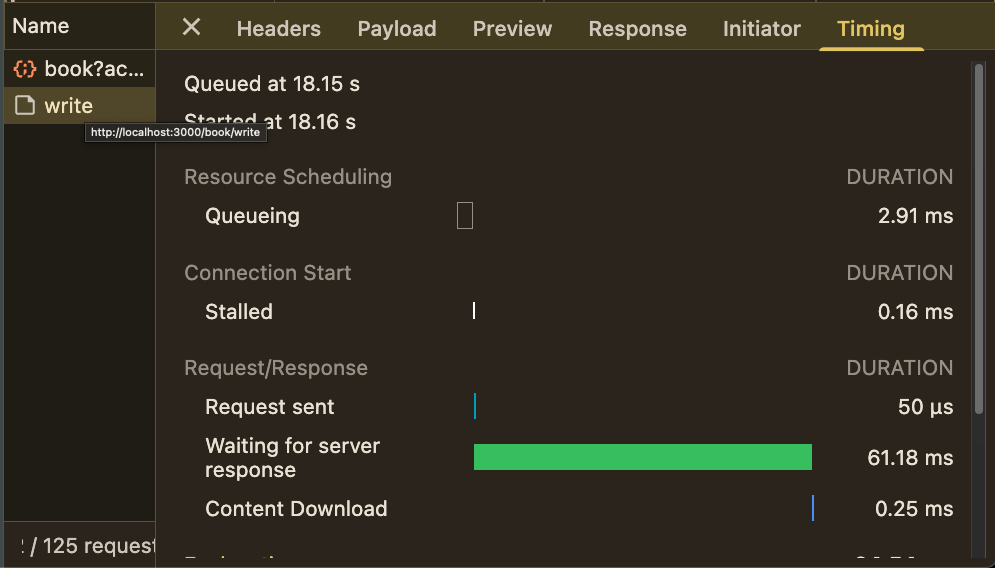
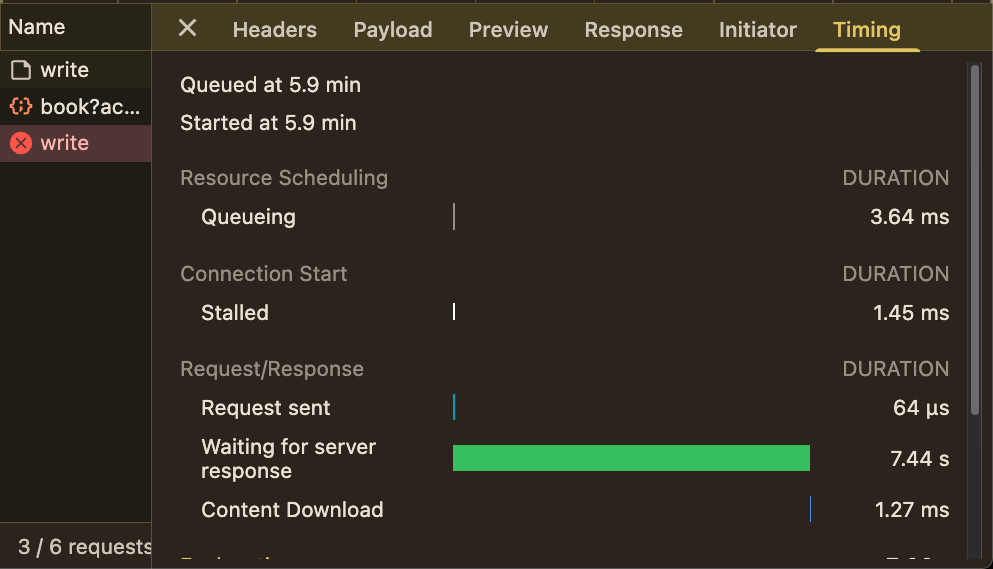
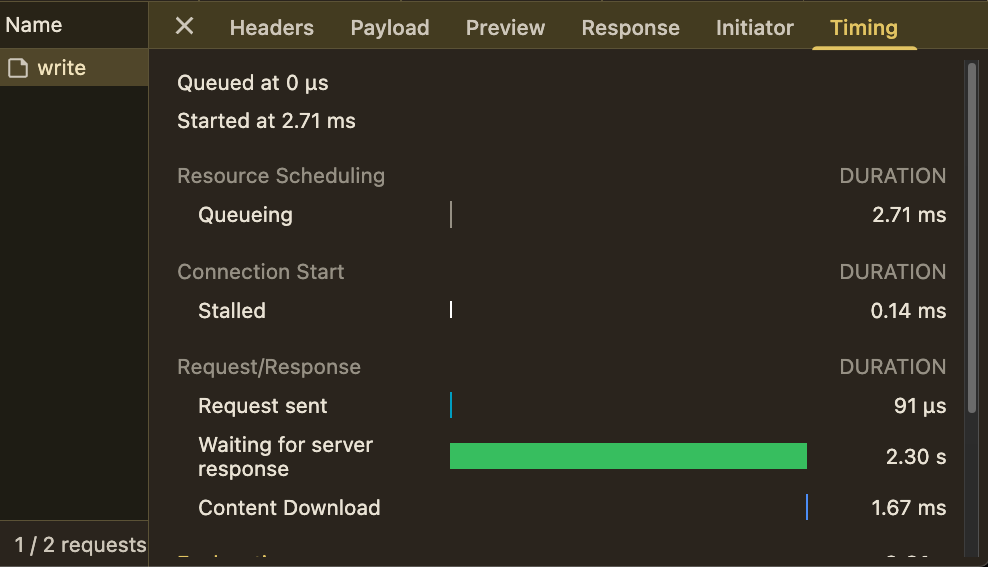
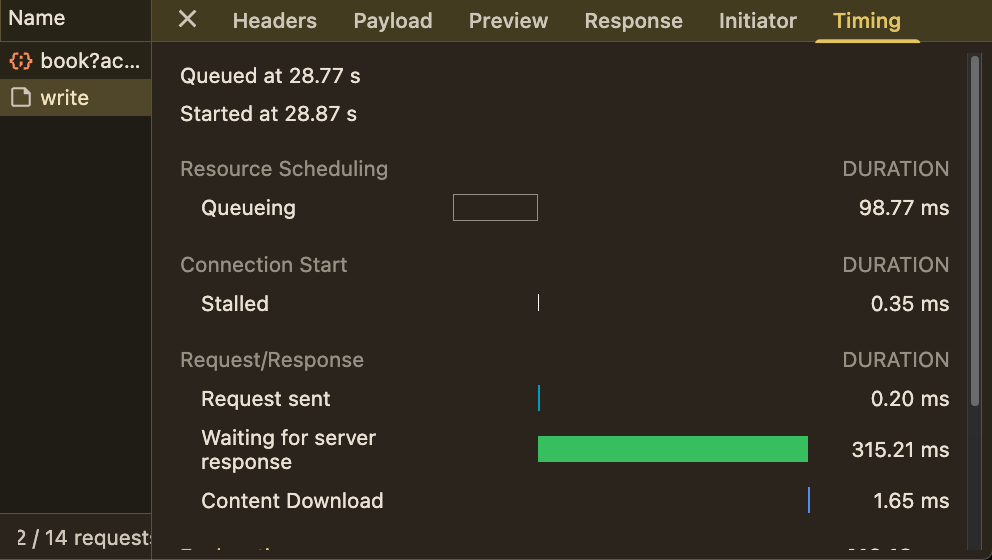

# database 응답 속도가 느린 문제

- 발생 시각: 2026-01-02
- 문제: 문제집을 생성하는 데에 7초가 넘게 걸림
- 해결 시각: 2026-01-09 18:59

## 배경

- db에 굉장히 적은 양의 행만 추가를 하는 데에 7초가 넘는 시간이 걸림

## 분석

### 후보

- network latency: 서버가 먼 곳이어서 그럴지도
- cold start

#### network latency

- railway의 client, api server를 singapore로 region을 바꿈
- Neon은 Free Plan이면 "AWS US East 1 (N. Virginia)"으로 고정되어 바꿀 수 없음
- railway만 바꾸었지만 시간은 여전히 5~7초대

#### cold start

- `console.time`으로 주요 대목의 소요 시간 파악
- prisma의 첫 번째 요청이 특히 오래 걸림
- server가 깨어나고 나면 ms 단위로 응답시간이 줄어듦

#### 결론: Neon Free Plan cold start

- Neon의 무료 플랜: cold start <- 이게 문제일 것

## 해결 과정

### local PostgreSQL: around 60ms

- 61.18ms
- 데이타베이스를 직접 배포하면 될 것이라 판단

### railway PostgreSQL: still 7s -> around 2s

#### why 7s

- 7.44s
- better, but a lot slower than local psql
- newly deployed postgreSQL server was "US East (Virginia, USA)"

#### change region -> 2s

- 2.30s
- change region to "Southeast Asia (Singapore)"

#### why still a lot slower than local server

- I was testing with local client, local api, railway db, not getting advantage of internal network

### use internal network: around 300ms

- 315.21ms
- client, api, db 모두 railway로 배포된 것으로 테스트: 315.21ms

## 결론

- 최초 소요 시간: 7000ms
- 최종 소요 시간: 315ms
- 성능 개선: 22배 성능 개선
