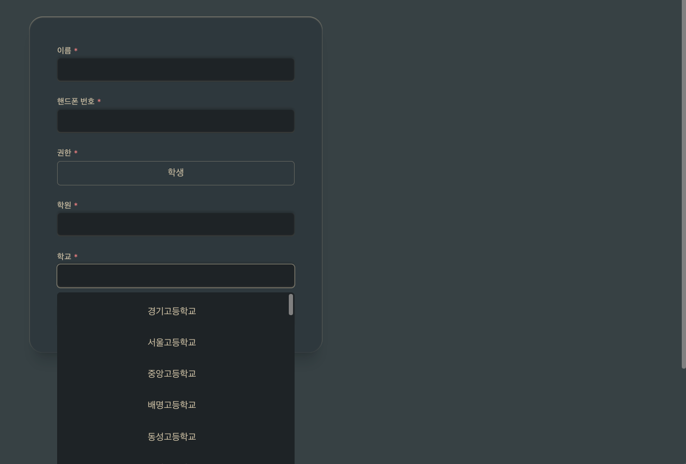
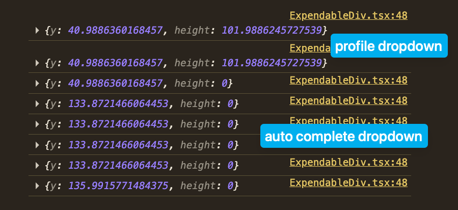

# 드롭다운 콘텐트가 뷰포트 아래로 내려가는 문제 발생

- 발생일: 2025-12-18 4:44
- 문제: 드롭다운 콘텐트가 뷰포트 아래로 내려가는 문제 발생

## 오류

- 화면 밖으로 콘텐트가 나감
  
- auto complete만 useMeasure 의 height이 감지가 안 됨
  
- auto complete content가 trigger를 덮도록 한 번 뜨고 나면 이후로는 이걸 열 수가 없음. 클릭 이벤트 충돌 같은데...
  

## 원인 파악

### (완) AutoCompleteContent의 내용물 없애니 정상 작동 -> 하나하나 채워나감

### (완) ExpandableDiv에 absolute를 줘야 하는데 그 안 내용물에 absolute를 줘서 그런 것 <- 이게 왜 문제인지는 모르겠다

```tsx
<ExpandableDiv>
    {isVisible && (
        <RoundBox
            ref={contentRef}
            color="bg2"
            padding="md"
            className="mt-my-sm absolute top-full max-h-[500px] w-full overflow-y-scroll"
        >
            <Vstack>
                {filteredOptionArray.map((option) => (
                    <AutoCompleteOption key={option}>{option}</AutoCompleteOption>
                ))}
            </Vstack>
        </RoundBox>
    )}
</ExpandableDiv>
```

### 위로 끌어올렸더니 on -> off 한 다음 다시 클릭하면 콘텐트가 떴다가 바로 없어짐

#### 시도한 것

- debugger를 찍으며 어디를 살펴봐야 하는지 확인 -> useDetectOutside로 범위를 좁힘
- triggerRef.current 는 존재를 하는데 input을 클릭하는 게 `triggerRef.current.contains(event.target as Node)` 에 걸리지 않음

```ts
const useDetectOutsideClick = <T extends HTMLElement>(
    triggerRef: React.RefObject<T | null>,
    isOn: boolean,
    onOutsideClick: () => void,
) => {
    const contentRef = useRef<HTMLDivElement>(null)

    const handleClick = (event: MouseEvent) => {
        if (!contentRef.current) {
            return
        }

        if (contentRef.current.contains(event.target as Node) || triggerRef.current?.contains(event.target as Node)) {
            debugger
            return
        }

        if (!triggerRef.current) debugger
        if (!triggerRef.current?.contains(event.target as Node)) debugger
        // input을 클릭하면 여기에 걸림
        // current: input
        // target: div.relative - auto complete component itself
        // 왜 target이 저기에서 멈추는지 모르겠다
        // TODO: 다른 곳에도 debugger를 찍어서 이벤트 발생 순서를 확인하자
        debugger
        onOutsideClick()
    }
    // ...
}
```

#### 접근법이 잘못되었다!: auto complete이니 검색창이 계속 보여야 함

### 새로운 문제: 크기 조절시 발생하는 문제: 자식 높이 측정, 조정값 계산, 적용 -> 자식 리렌더 -> 자식 높이 재측정 -> 문제 없음 -> 초기화

## 해결 ---- 못 함: 현재로서는 임시방편으로 길이만 줄여둔 상황

### (완) height 0: position 관련 내용은 모두 ExpandableDiv로 분리

```tsx
<ExpandableDiv isInBound className="mt-my-sm absolute top-full w-full">
    {isVisible && (
        <RoundBox ref={contentRef} color="bg2" padding="md" className="max-h-[500px] overflow-y-scroll">
            <Vstack>
                {filteredOptionArray.map((option) => (
                    <AutoCompleteOption key={option}>{option}</AutoCompleteOption>
                ))}
            </Vstack>
        </RoundBox>
    )}
</ExpandableDiv>
```

- 수정본

- 소요 시간:

### (완) 뷰포트에 가두

```tsx
const [ref, { y, height }] = useMeasure()
const diff = window.innerHeight - y - height
const style = { top: `calc(100% + ${diff}px)` }
```

### 위치 수정 로직을 아래와 같이 수정

- 뷰포트 초과하면 그만큼 높이를 줄임
- 높이가 최소높이보다 좁아지면 위로 올림
- 위에서도 뷰포트 안에 머물게 함 - 단 이 때는 최소 높이가 없음

### 높이 줄이고 위로 올리기만 하자

- 위로 올리면 밑에 있다가 위로 올라가는 애니메이션이 있음. 그리고 이것이 인풋을 덮기 때문에 인풋을 클릭하면 콘텐트가 바로 꺼짐

## 해봐야 하는 것

### motion.div가 문제인가? 단순 div들만으로 구현할 때에도 문제가 되나

### 이게 되고 나면 floating ui 이용해서 크기 조절하는 걸 해봐야 할 것 같기도...

## 소요 시간

## 참고

### 높이 계산 방법 유튜브 - `window.innerHeight` 이 핵심임

- https://www.youtube.com/watch?v=q6HevBxsPUM&t=1250s
