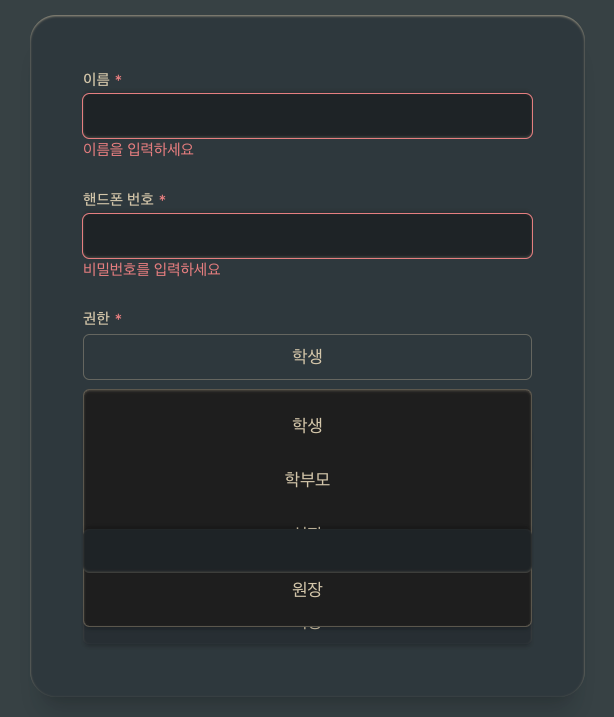
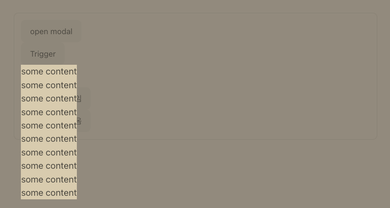

## relative끼리 z index stack이 쌓이는데 dropdown들을 어떻게 세로로 정렬하지?

- 발생일: 2025-12-17 6:48
- 문제: 예전엔 도대체 이걸 어떻게 해결했지
- 오류
    - SelectContent를 펼치면 밑의 trigger를 가리지 못함
      
        - relative z-stack 문제 정리: absolute끼리의 z-index는 같은 relative stack끼리만 적용됨. 그 외에는 아래의 absolute가 위로 감
           - relative는 z-stack이 없기 때문에 모든 absolute의 z-stack로 덮을 수 있음
        - 그런데 왜 못 가리지...
- 원인 파악:
    - `<DropAnimation />`을 사용할 때만 문제 발생
- 해결:
    - `motion.div`에 absolute, z-index 부여
- 소요 시간: 3시간
